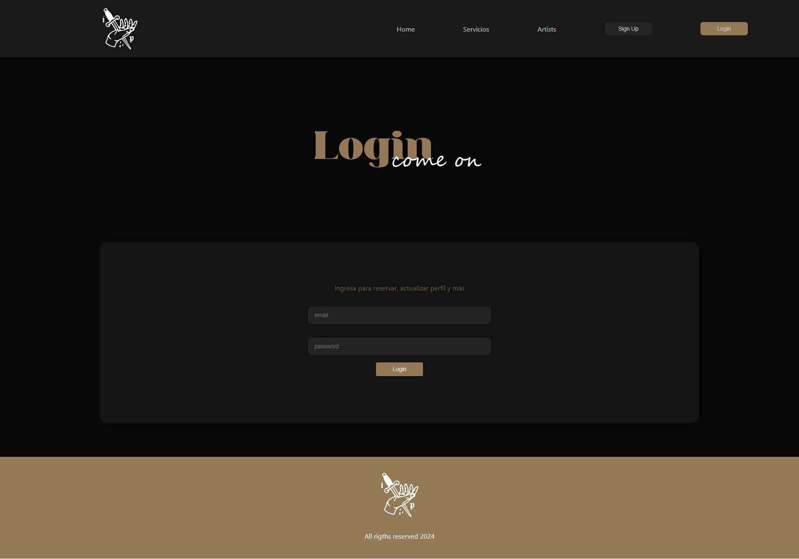
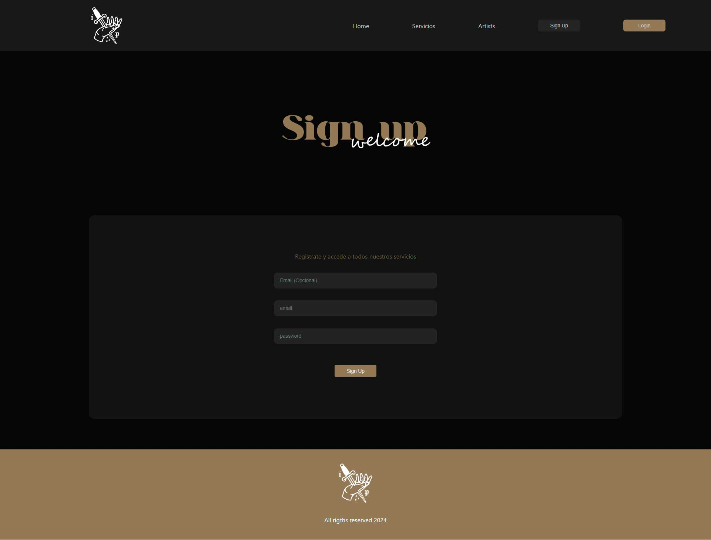
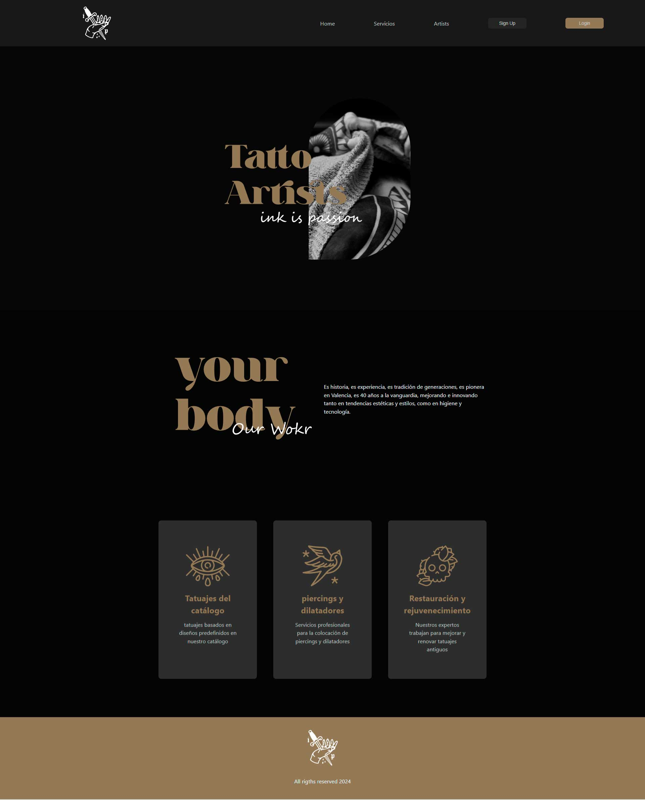
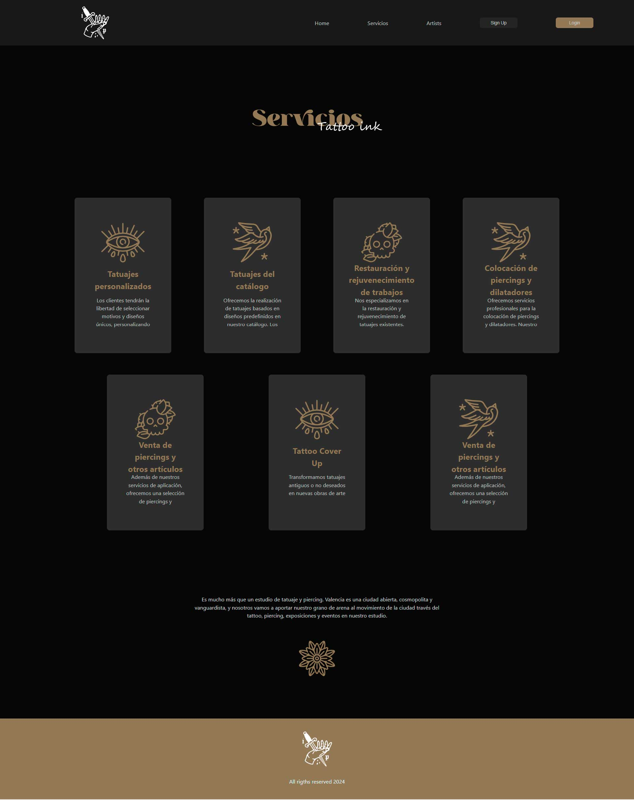
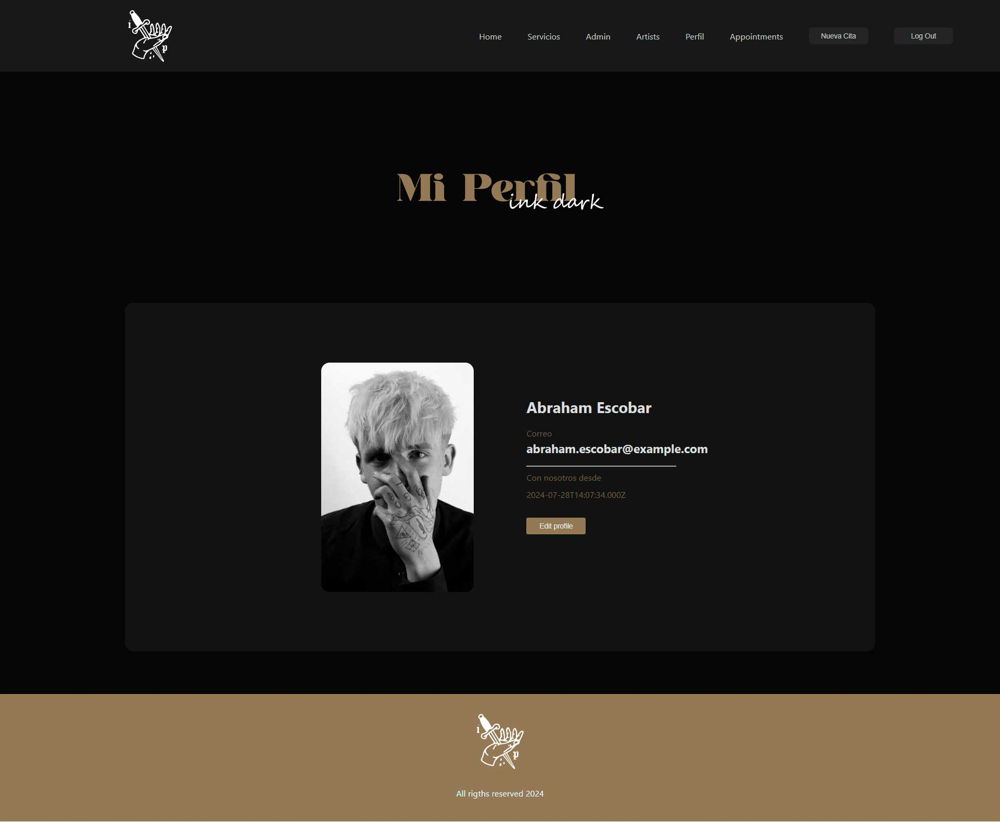
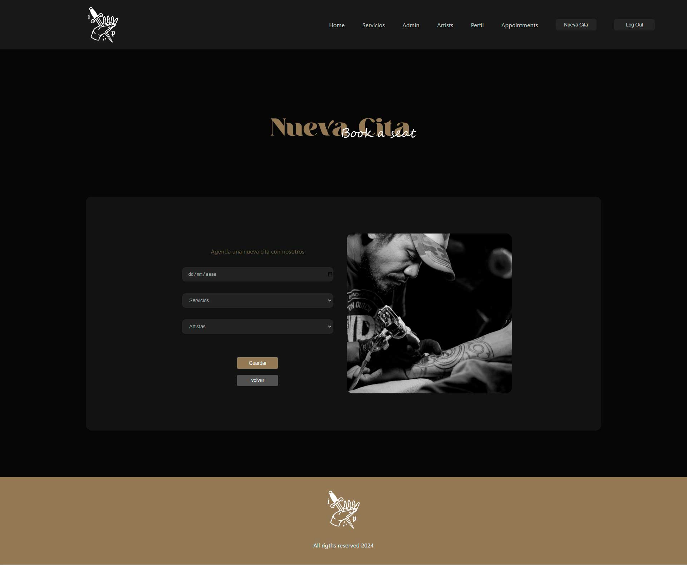
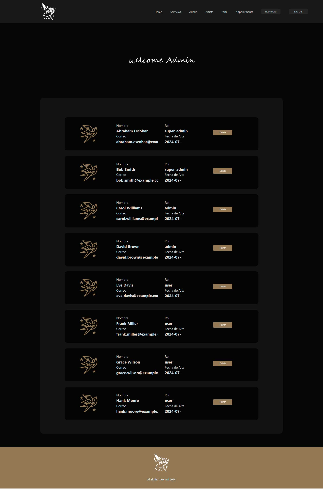
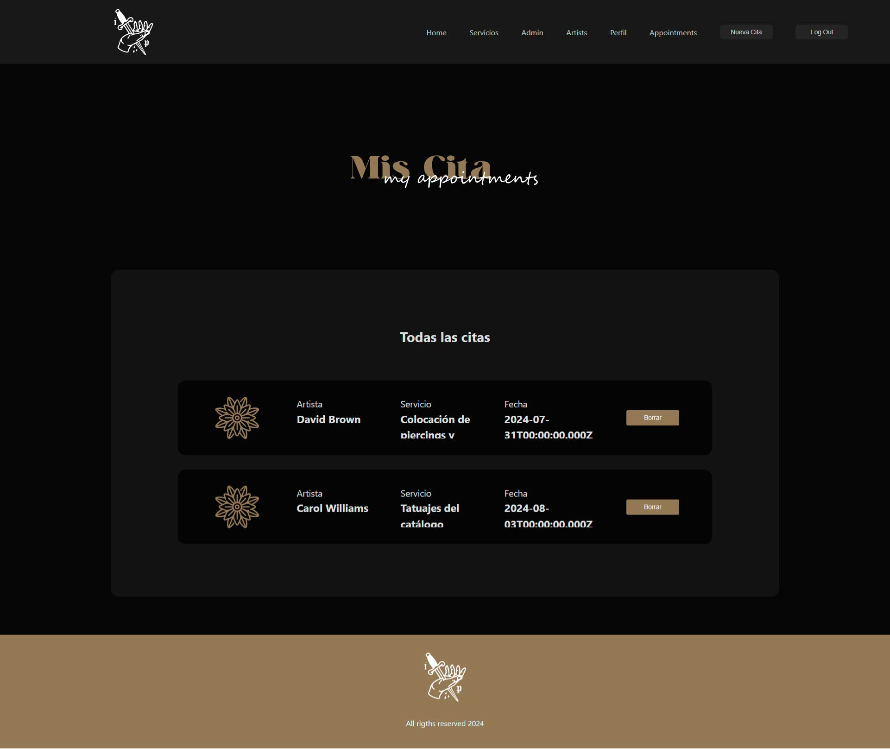

<details>
  <summary>Content</summary>
  <ol>
    <li><a href="#Objective">Objetive</a></li>
    <li><a href="#project-description">Project Description</a></li>
    <li><a href="#stack">Stack</a></li>
    <li><a href="#deploy">Deploy</a></li>
    <li><a href="#local-installation">Local Installation</a></li>
    <li><a href="#future-features">Future Features</a></li>
    <li><a href="#contributions">Contributions</a></li>
    <li><a href="#contact ">Contact</a></li>
  </ol>
</details>

# Tattoo Studio Frontend Project

## Objective

The objective of this project is to develop the user interface of a website for a tattoo studio, enabling users to create accounts, manage their profiles, and schedule appointments.

## Project Description

This frontend project has been developed using Node.js as the runtime environment and React as the library for integrating JavaScript and HTML. The website includes various views, such as:

- **Home**
- **Services**
- **Artists**
- **Login**
- **Sign Up**
- **Profile Panel**
- **Appointments Panel**
- **Create New Appointments**

Administrators have access to a special panel for user management. This frontend communicates with an API that interacts with a MySQL database.

## Stack 
Technologies Used
<div align="left">
<a href="https://www.reactjs.com/">
    
</a>
</a>
<a href="https://nodejs.org/es/">
    
</a>
<a href="https://developer.mozilla.org/es/docs/Web/JavaScript">
    
</a>
<a href="https://www.github.com/">
    
</a>
<a href="https://git-scm.com/">
    
</a>
 </div>

## Deploy 
<div align="left">
    <a href="https://tattoostudio.zeabur.app"><strong>Production URL </strong></a>
</div>

## Local Installation

To install and run the project locally, follow these steps:

1. Clone the repository:
    ```sh
    git clone https://github.com/AbrahamEsc1911/FSD-FRONTEND-TATTOO-STUDIO
    cd your-repo
    ```

2. Install project dependencies:
    ```sh
    npm install
    ```

3. Start the frontend development server:
    ```sh
    npm run dev
    ```

4. Set up and start the backend server:
    - Clone the repository:
      ```sh
        git clone Backend https://github.com/AbrahamEsc1911/FSD-BACKEND-TATTOO-STUDIO
    - Ensure that the MySQL database is running.
    - Use the CORS library to allow connections between the frontend and backend.
    - Navigate to the backend directory and execute the following commands:
    ```sh
    cd ../your-repo-backend
    npm install
    npm run dev
    ```

## Screenshots

**login**

**sign up**

**home**

**Services**

**profile**

**nueva cita**

**admin panel**

**mis citas**



## Future Features

- Make the design fully responsive.
- Allow users to change their passwords.
- Allow users to edit their appointments.
- Allow users to upload a profile picture.

## Contributions
Suggestions and contributions are always welcome.

You can do it in two ways:

1. Opening an issue
2. Fork the repository
    - Create a new branch
        ```
        $ git checkout -b feature/username-improvement
        ```
    - Commit your changes
        ```
        $ git commit -m 'feat: improve X feature'
        ```
    - Push to the branch
        ```
        $ git push origin feature/username-improvement
        ```
    - Open a Pull Request

    ## Contact 
<a href = "mailto:abrancho1908@gmail.com"></a>
<a href="https://www.linkedin.com/in/abraham-escobar-angola-237a20224/" target="_blank"></a> 
</p>